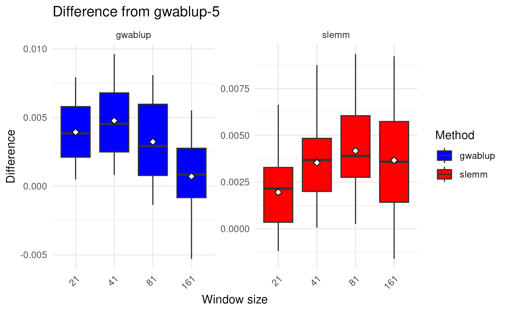

# Comparative benchmarking of GWABLUP and SLEMM for genomic prediction

## References
[GWABLUP](https://gsejournal.biomedcentral.com/articles/10.1186/s12711-024-00881-y)  
[SLEMM](https://academic.oup.com/bioinformatics/article/39/3/btad127/7075542)

## Introduction
- [SLEMM](https://github.com/jiang18/slemm) has a function for fast window-based SNP-weigthing. 
- GWABLUP's SNP weighting scheme is seemingly different but actually falls in largely the same framework as SLEMM.
- The key difference between the two is described as follows. If x denotes a SNP's weight that SLEMM calculates based on windows, then GWABLUP's (unscaled) weight is approximately equal to $y=\frac{\pi}{\pi + (1-\pi) \exp(-x/2)}$. The relationship is approximate in that x approximates single-SNP association chi-square statistics.
- Compared to SLEMM weights, the GWABLUP weights have the following features:
  - The ratio of max and min weights is constrained to $1/\pi$. As a result, $\pi$ should be set to a sufficiently small value to accommodate very large effects (like *DGAT1* for dairy milk traits).
  - The x-to-y transformation reduces small weights toward 0 and amplifies large weights.

## Dataset
- Dairy bulls (https://doi.org/10.1534/g3.114.016261)
  - Three traits: milk (mkg), fat percentage (fpro), and somatic cell score (scs)
  - 5024 individuals and 42552 SNPs after quality control
  - Pre-processed data (Cattle_geno and Cattle.csv) can be found in the current directory.

## Validation
- Repeated random subsampling validation
  - 80% as training, and the remaining 20% as validaiton
  - 20 replicates
- Prediction accuracy is quantified by the Pearson correlation coefficient between the GEBVs and observed phenotypic values of individuals in the validation set. 

## Fast implementation of GWABLUP
- The GWABLUP weights are calculated based on **GCTA --mlma**.  
- We use the GWABLUP weights in SLEMM to enable fast GWABLUP. This implementation has a minor difference from the original GWABLUP in terms of MAF-based genotype scaling: it uses VanRaden's GRM 2 as backbone, while GWABLUP uses VanRaden's GRM 1.

## Results
- The difference of prediction accuracy between **SLEMM --iter_weigthing** and **GWABLUP** is minimal, approximately 0.1 percentage points, for all three dairy traits when using the optimal window size for each method.
- The figure below shows the prediciton accuracies for milk yield.

## Discussion
Implementing fast GWABLUP is straighforward in SLEMM, as only one additional line of code is required; however, more comparative benchmarking is needed for the change. 
